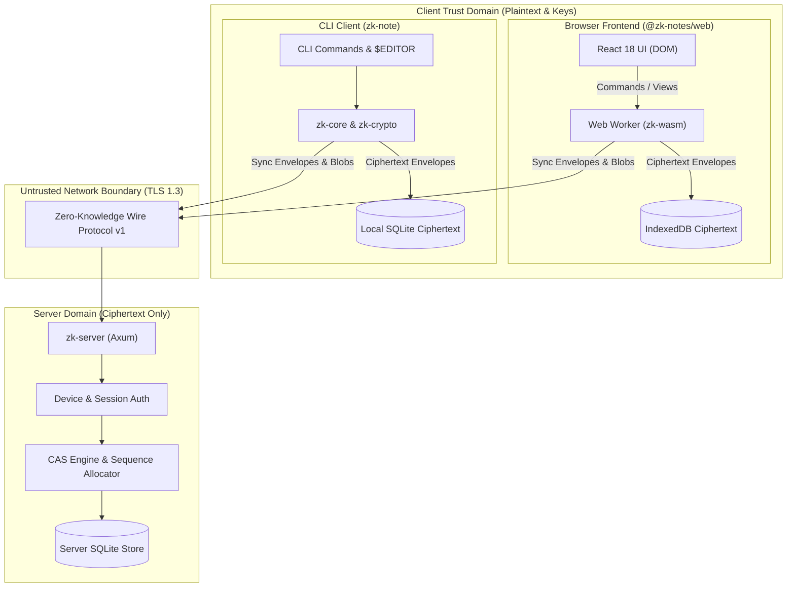

# Zero-Knowledge Notes (`zk-notes`)

[](#testing--quality-gates)
[](docs/release-notes-v1.0.0-rc1.md)
[](Cargo.toml)
[](crates/zk-wasm)
[](Cargo.toml)

A zero-knowledge, offline-first note-taking application featuring:
- **End-to-End Client-Side Encryption**: Notes, titles, tags, search indices, attachment filenames, and attachment payloads are encrypted before ever touching the network or disk.
- **Server Obliviousness**: The sync server stores exclusively opaque ciphertext envelopes and sequence metadata; it is structurally incapable of decrypting user data.
- **Guarded Multi-Device Synchronization**: Compare-And-Swap (CAS) revision checks prevent silent overwrite of stale offline edits.
- **Structured 3-Way Merge**: Native `diff3` text merging combined with tag set union and conflict record retention.
- **Shared Rust Core**: Unified cryptographic and synchronization logic shared across native CLI (`zk-note`) and modern web (`@zk-notes/web` via WebAssembly).

---

## Table of Contents
1. [Core Security Invariants](#1-core-security-invariants)
2. [System Architecture & Trust Boundaries](#2-system-architecture--trust-boundaries)
3. [Component Overview](#3-component-overview)
4. [Quick Start (Local Development)](#4-quick-start-local-development)
5. [CLI Manual & Usage Cheatsheet](#5-cli-manual--usage-cheatsheet)
6. [Web Client Manual](#6-web-client-manual)
7. [Production Deployment Manual](#7-production-deployment-manual)
8. [Testing & Quality Gates](#8-testing--quality-gates)
9. [Documentation Index](#9-documentation-index)

---

## 1. Core Security Invariants

These invariants are mathematically and architecturally enforced across the entire codebase:

| Invariant | Title | Enforcement |
| :--- | :--- | :--- |
| **SEC-001** | Plaintext Never Crosses Network | Notes, titles, tags, attachment filenames, and search queries are encrypted client-side using `XChaCha20-Poly1305` before network transmission. |
| **SEC-002** | Server Cannot Decrypt User Content | `zk-server` depends strictly on `zk-protocol` and has **zero** dependency on `zk-crypto` or `zk-core`. It cannot decrypt user data. |
| **SEC-003** | No Secrets in Application Logs | Master passphrases, recovery keys, session tokens, and note contents are never logged (redacted to `[REDACTED]`). |
| **SEC-004** | Authenticated Encryption Only | Every payload is encrypted with `XChaCha20-Poly1305` (256-bit keys, 192-bit nonces) with authenticated associated data (AAD). |
| **SEC-005** | Nonce Uniqueness | 192-bit nonces generated via cryptographically secure RNGs (`OsRng`) ensure $2^{-96}$ collision safety. |
| **SEC-006** | Conflict Safety (CAS) | Server rejects stale mutations where `expected_revision != current_revision` with `409 Conflict`. Zero silent overwrites. |
| **SEC-007** | Mutation Retry Safety | Every mutation binds an idempotency digest. Retrying an accepted mutation returns the existing revision without duplicating writes. |
| **SEC-008** | Deletion Safety | Deletions generate revisioned tombstones. Stale clients cannot resurrect deleted notes without explicit conflict resolution. |
| **SEC-009** | Local Persistence is Encrypted | Persistent SQLite databases (`notes.db`) and browser IndexedDB stores (`zk_notes_db`) store exclusively ciphertext envelopes. |
| **SEC-010** | Cryptographic Errors Fail Closed | Any tampered ciphertext, corrupted MAC tag, or incorrect passphrase aborts immediately; no partial plaintext is ever returned. |

---

## 2. System Architecture & Trust Boundaries



### Crate Dependency Direction
```text
zk-protocol (wire models, version constants, error codes)
   ▲          ▲
   │     zk-storage (storage traits: object, mutation, conflict, blob)
   │          ▲
zk-crypto     │ (Argon2id, XChaCha20-Poly1305, BLAKE2, zeroize)
   ▲          │
   │          │
zk-core ──────┤ (note domain model, in-memory search, vault lifecycle)
   ▲          │
   │          │
zk-sync ──────┘ (sync orchestrator, CAS engine, 3-way merge, conflict resolution)
   ▲
   ├──────────────────────────┬──────────────────────────┐
apps/cli                   crates/zk-wasm             apps/server
(native terminal client)   (WASM bindings)            (sync coordinator)
                                  ▲                   * depends ONLY on zk-protocol
                                  │
                             apps/web (React 18 UI)
```

---

## 3. Component Overview

| Subsystem | Location | Description | Manual |
| :--- | :--- | :--- | :--- |
| **`zk-server`** | [`apps/server/`](apps/server/) | High-performance sync server and ciphertext store. Manages revision sequencing, CAS validation, opaque blob chunks, and device authentication. | [Server Manual](apps/server/README.md) |
| **`zk-cloudflare-worker`** | [`apps/cloudflare-worker/`](apps/cloudflare-worker/) | Optional Rust Worker backend using D1 metadata and private R2 ciphertext blobs while preserving the `/v1/*` contract. | [Cloudflare Deployment](docs/deployment-cloudflare.md) |
| **`zk-note`** | [`apps/cli/`](apps/cli/) | Terminal interface with `$EDITOR` integration, RAM-backed tmpfs zeroization, in-memory search, and conflict resolution. | [CLI Manual](apps/cli/README.md) |
| **`@zk-notes/web`** | [`apps/web/`](apps/web/) | React 18 browser client with Web Worker crypto isolation, IndexedDB offline persistence, live Markdown editor, and visual conflict resolver. | [Web Manual](apps/web/README.md) |
| **`zk-crypto`** | [`crates/zk-crypto/`](crates/zk-crypto/) | Cryptographic primitives: Argon2id KDF, XChaCha20-Poly1305 AEAD, BLAKE2b hashing, and 288-bit typo-detecting recovery keys. | [Crypto ADR](docs/adr/0003-cryptographic-architecture.md) |
| **`zk-sync`** | [`crates/zk-sync/`](crates/zk-sync/) | Synchronization state machine, CAS push queue, pull cursors, diff3 three-way text merge, and conflict record store. | [Protocol Spec](docs/protocol/v1.md) |

---

## 4. Quick Start (Local Development)

### Prerequisites
- **Rust**: 1.80.0+ (`rustup update stable`)
- **WASM Target**: `rustup target add wasm32-unknown-unknown`
- **wasm-pack**: `cargo install wasm-pack`
- **Node.js**: v20.x or v22.x LTS with `npm`

### Step 1: Start the Sync Server
```bash
cargo run --bin zk-server
# Server listens on http://127.0.0.1:8080
```

### Step 2: Initialize & Use the CLI Client
In a separate terminal:
```bash
# Compile CLI binary
cargo build --bin zk-note

# Initialize new encrypted vault (record your 288-bit Recovery Key!)
./target/debug/zk-note init

# Create a note
./target/debug/zk-note new --title "My First Note" --body "Encrypted end-to-end" --tag "ideas"

# List notes
./target/debug/zk-note list

# Edit in your text editor ($EDITOR)
./target/debug/zk-note edit <note-id>
```

### Step 3: Launch the Web Client
In a third terminal:
```bash
# 1. Compile WebAssembly core
wasm-pack build --target web crates/zk-wasm --out-dir pkg

# 2. Install dependencies & start Vite dev server
cd apps/web
npm install
npm run dev
# Open http://localhost:5173/ in your browser
```

---

## 5. CLI Manual & Usage Cheatsheet

`zk-note` provides rich command-line workflows:

```bash
# Vault Authentication & Security
zk-note init                             # Initialize vault and display 288-bit recovery key
zk-note unlock [--timeout <minutes>]     # Unlock vault session (default 15m idle timeout)
zk-note lock                             # Immediately lock session and scrub keys from memory
zk-note autolock [--timeout <minutes>]   # Configure auto-lock idle timeout policy
zk-note passwd                           # Rotate master passphrase (re-wraps vault key)
zk-note recover --recovery-key <key>     # Restore vault access and reset forgotten passphrase

# Note Authoring & Search
zk-note new --title "Title" --body "..." # Create a new note
zk-note list [--tag <tag>] [--json]      # List notes (supports tag filtering and JSON)
zk-note show <note-id>                   # Display decrypted note
zk-note edit <note-id>                   # Edit note title, tags, and body in $EDITOR
zk-note search <query>                   # Fast in-memory full-text search with snippet context
zk-note history <note-id> [--revision N] # Inspect revision history or view historical revision
zk-note delete <note-id> [--purge]       # Delete note (tombstone for sync, or hard-purge)

# Encrypted Attachments
zk-note attach <note-id> <file-path>     # Attach binary file (chunked 256 KiB encryption)
zk-note attachments <note-id>            # List attachments on a note
zk-note detach <note-id> <attachment-id> # Remove attachment

# Multi-Device Sync & Conflict Resolution
zk-note login --server <url> --token <t> # Authorize device with sync server
zk-note whoami                           # View authenticated account and device identity
zk-note device list                      # List authorized devices and active sessions
zk-note device revoke <device-id>        # Revoke an authorized device
zk-note conflicts                        # List active unresolved conflict records
zk-note resolve <conflict-id> --merge    # Resolve conflict via 3-way merge in $EDITOR
zk-note resolve <conflict-id> --local    # Resolve conflict keeping local version
zk-note resolve <conflict-id> --remote   # Resolve conflict accepting remote version
zk-note resolve <conflict-id> --duplicate# Resolve conflict preserving both versions

# Interactive Terminal UI (TUI)
zk-note tui                              # Launch lazygit-style interactive terminal UI (>= 80x24)
```

For complete CLI and TUI documentation, keybindings, and workflows, see [`apps/cli/README.md`](apps/cli/README.md).

---

## 6. Web Client Manual

`@zk-notes/web` provides a secure, reactive browser environment:

- **Isolated Web Worker (`zk-wasm`)**: Cryptographic keys are confined to worker linear memory and isolated from the main DOM thread.
- **Zero-Knowledge IndexedDB (`zk_notes_db`)**: Envelopes, pending mutations, base revisions, and conflicts are stored encrypted locally.
- **Biometric WebAuthn Passkeys**: Authenticate devices with Touch ID, Face ID, Windows Hello, or hardware security keys (YubiKeys).
- **Fast Search (`Cmd+K` / `Ctrl+K`)**: Multi-field in-memory search across titles, Markdown bodies, and tags.
- **4-Way Visual Conflict Resolver**: Side-by-side visual comparison with `diff3` candidate preview, manual edit, or non-destructive duplication.
- **Encrypted Streaming Attachments**: Client-side chunking and streaming decryption via safe `blob:` URLs.

For full web setup and configuration, see [`apps/web/README.md`](apps/web/README.md).

---

## 7. Production Deployment Manual

Cloudflare Workers Free is an optional deployment target alongside the native
VPS/systemd server. It uses local simulated D1/R2 for development and keeps the
same protocol contract. See [Cloudflare deployment](docs/deployment-cloudflare.md).

### 7.1 Deploying `zk-server` (Backend)

#### Environment Variables Configuration
Configure `zk-server` via environment variables:
```bash
export ZK_SERVER_HOST=0.0.0.0
export ZK_SERVER_PORT=8080
export ZK_SERVER_DB_PATH=/var/lib/zk-notes/server.db
export ZK_SERVER_LOG_LEVEL=info
export ZK_SERVER_LOG_FORMAT=json
export ZK_SERVER_ACCOUNT_BLOB_QUOTA=1073741824 # 1 GiB quota
```

#### Systemd Service (`/etc/systemd/system/zk-server.service`)
```ini
[Unit]
Description=Zero-Knowledge Notes Sync Server
After=network.target

[Service]
Type=simple
User=zknotes
Group=zknotes
WorkingDirectory=/var/lib/zk-notes
Environment=ZK_SERVER_HOST=127.0.0.1
Environment=ZK_SERVER_PORT=8080
Environment=ZK_SERVER_DB_PATH=/var/lib/zk-notes/server.db
Environment=ZK_SERVER_LOG_LEVEL=info
Environment=ZK_SERVER_LOG_FORMAT=json
ExecStart=/usr/local/bin/zk-server
Restart=always
RestartSec=5s

ProtectSystem=strict
ProtectHome=true
ReadWritePaths=/var/lib/zk-notes
PrivateTmp=true

[Install]
WantedBy=multi-user.target
```

#### Automated Live Backups (`VACUUM INTO`)
Because the server database contains only ciphertext envelopes, hot snapshots can be safely generated without stopping the service:
```bash
sqlite3 /var/lib/zk-notes/server.db "VACUUM INTO '/backups/server-$(date +%Y%m%d%H%M%S).db';"
```

---

### 7.2 Deploying Web Client & Reverse Proxy

Deploy `apps/web/dist` behind a reverse proxy (Nginx or Caddy) enforcing strict Content Security Policy (CSP Level 3) and Cross-Origin Isolation headers.

#### Nginx Configuration (`/etc/nginx/sites-available/notes.conf`)
```nginx
upstream zk_backend {
    server 127.0.0.1:8080;
    keepalive 32;
}

server {
    listen 443 ssl http2;
    server_name notes.example.com;

    ssl_certificate /etc/letsencrypt/live/notes.example.com/fullchain.pem;
    ssl_certificate_key /etc/letsencrypt/live/notes.example.com/privkey.pem;

    root /var/www/zk-notes/dist;
    index index.html;

    # Mandatory Zero-Knowledge Security Headers
    add_header Content-Security-Policy "default-src 'none'; script-src 'self' 'wasm-unsafe-eval'; style-src 'self' 'unsafe-inline'; connect-src 'self'; img-src 'self' data: blob:; font-src 'self'; object-src 'none'; base-uri 'self'; form-action 'self'; frame-ancestors 'none'; upgrade-insecure-requests;" always;
    add_header X-Frame-Options "DENY" always;
    add_header X-Content-Type-Options "nosniff" always;
    add_header Referrer-Policy "no-referrer" always;
    add_header Cross-Origin-Opener-Policy "same-origin" always;
    add_header Cross-Origin-Embedder-Policy "require-corp" always;
    add_header Cross-Origin-Resource-Policy "same-origin" always;
    add_header Strict-Transport-Security "max-age=63072000; includeSubDomains; preload" always;

    # Single-page application router fallback
    location / {
        try_files $uri $uri/ /index.html;
    }

    # API Proxy to zk-server
    location /v1/ {
        proxy_pass http://zk_backend/v1/;
        proxy_http_version 1.1;
        proxy_set_header Host $host;
        proxy_set_header X-Real-IP $remote_addr;
        proxy_set_header X-Forwarded-For $proxy_add_x_forwarded_for;
        proxy_set_header X-Forwarded-Proto $scheme;
    }
}
```

Pre-built production configurations are available in [`deploy/nginx/`](deploy/nginx/) and [`deploy/caddy/`](deploy/caddy/).

---

## 8. Testing & Quality Gates

The repository is guarded by 9 automated quality gates and specialized security audit suites:

### 8.1 Full Repository Quality Gate
```bash
./scripts/ci.sh
```
Executes all 9 gates:
1. `cargo fmt --check`
2. `cargo clippy --workspace --all-targets --all-features -- -D warnings`
3. `cargo check --workspace --locked`
4. `cargo test --workspace --all-targets --all-features` (Rust unit and integration tests)
5. `cargo check --target wasm32-unknown-unknown`
6. `wasm-pack test --node crates/zk-wasm`
7. Native / WebAssembly cross-runtime cryptographic parity suite (`tests/wasm_crypto_compat.test.mjs`)
8. Web application tests (`npm run typecheck && npm test`)
9. Supply-chain security audit (`./scripts/audit.sh` with `cargo-audit` and `npm audit`)

### 8.2 Automated Release Candidate Demonstrations
```bash
./scripts/demo_rc.sh
```
Runs end-to-end demonstrations of:
- **Two-Client Offline Conflict & Resolution**: Concurrent offline edits, atomic CAS rejection (`409 Conflict`), local conflict preservation, 3-way merge resolution, remote convergence, and zero-knowledge database audit.
- **Passphrase Loss & Recovery**: Vault creation, simulated forgotten passphrase lockout, constant-time recovery key unwrap, passphrase rotation, old passphrase fail-closed verification, and 100% data integrity check across stored notes.

### 8.3 Specialized Security Test Suites
```bash
# 1. Plaintext Leakage Audit (scans server DB, logs, network traces, client DBs)
cargo test --test plaintext_leakage_tests -p zk-server

# 2. Concurrency Stress Suite (50 concurrent clients racing on identical notes)
cargo test --test concurrency_stress_tests -p zk-server

# 3. Protocol Property Tests (500-step randomized state machine fuzzing)
cargo test --test protocol_property_tests -p zk-server

# 4. Multi-Tenant Authorization Penetration Tests (IDOR and cross-account isolation)
cargo test --test authorization_penetration_tests -p zk-server

# 5. Backup & Restore Decryption Lifecycle Test
cargo test --test backup_restore_tests -p zk-server

# 6. Browser XSS & CSP Penetration Suite
npm test --prefix apps/web -- test/xss-csp-review.test.ts

# 7. IndexedDB Zero-Knowledge Storage Audit
npm test --prefix apps/web -- test/plaintext-leakage.test.ts
```

---

## 9. Documentation Index

- **Release Notes**: [`docs/release-notes-v1.0.0-rc1.md`](docs/release-notes-v1.0.0-rc1.md)
- **External Security Review Package**: [`docs/security-review-package.md`](docs/security-review-package.md)
- **Threat Model & Security Reviews**:
  - [Comprehensive Threat Model Review](docs/threat-model/threat-model-review.md)
  - [CLI Editor Security & Tmpfs Boundaries](docs/threat-model/cli-editor-security.md)
  - [Web Security & CSP Review](docs/threat-model/web-security-review.md)
  - [Supply-Chain & Dependency Audit Policy](docs/threat-model/dependency-audit.md)
- **Protocol Specifications**:
  - [Wire Protocol Specification v1](docs/protocol/v1.md)
  - [Web Worker RPC Protocol Specification](docs/protocol/worker-api.md)
- **Architecture Decision Records (ADRs)**:
  - [ADR-0001: Lint and Error Handling Conventions](docs/adr/0001-lint-and-error-conventions.md)
  - [ADR-0002: Storage Layer Traits & In-Memory Implementations](docs/adr/0002-storage-traits.md)
  - [ADR-0003: Cryptographic Architecture & Primitive Selection](docs/adr/0003-cryptographic-architecture.md)
  - [ADR-0004: CLI Editor Workflow & Temporary File Handling](docs/adr/0004-cli-editor-workflow.md)
  - [ADR-0005: 3-Way Line Merge Architecture](docs/adr/0005-diff3-merge-architecture.md)
  - [ADR-0006: Server SQLite Persistence & Migration Architecture](docs/adr/0006-server-sqlite-persistence.md)
  - [ADR-0007: Web Worker Cryptographic Isolation](docs/adr/0007-web-worker-isolation.md)
  - [ADR-0008: Passphrase Rotation & Recovery Key Architecture](docs/adr/0008-recovery-keys-and-rotation.md)
  - [ADR-0009: Streaming Encrypted Blob Attachments](docs/adr/0009-streaming-encrypted-attachments.md)
- **Human Testing Guide**: [`SMOKE_TEST.md`](SMOKE_TEST.md)
- **Task Tracking Roadmap**: [`TASKS.md`](TASKS.md)

---

## License

This project is dual-licensed under either the [Apache License, Version 2.0](LICENSE-APACHE) or the [MIT License](LICENSE-MIT).
