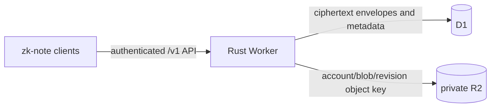

# Cloudflare deployment

The optional Cloudflare backend runs the existing `/v1/*` protocol in a Rust
Worker. D1 stores authentication, vault bootstrap, encrypted-object metadata,
history, idempotency records, sequence counters, and blob accounting. A private
R2 bucket stores only opaque ciphertext bytes. The native Axum/SQLite server
remains supported and is the reference implementation.



The Worker depends on `zk-protocol` and the server-only `zk-server-auth` crate.
It does not depend on `zk-crypto`, `zk-core`, `zk-sync`, client storage, or
plaintext note models. R2 has no public URL; all blob operations pass through
session authentication and use account-scoped immutable keys.

## Local setup

Install Rust, Node 22 or newer, and the WASM target. From the repository root:

```bash
rustup target add wasm32-unknown-unknown
cargo install worker-build --version 0.8.6 --locked
npm install --prefix apps/cloudflare-worker
cd apps/cloudflare-worker
npx wrangler d1 migrations apply zk-note-staging-db --local
npx wrangler dev --local
```

Wrangler uses simulated local D1 and R2 by default. Its generated `.wrangler`
state, Worker build output, local variables, and staging overrides are ignored
by Git. No Cloudflare account or production resource is used by these commands.

The reproducible local gate starts isolated native and Worker servers, applies
the D1 migration, and runs identical signed WebAuthn, sync, concurrency, device,
session, and blob fixtures against both:

```bash
PATH="$HOME/.cargo/bin:$PATH" node scripts/cloudflare-smoke.mjs
node apps/cloudflare-worker/tests/storage-failures.mjs
```

The second command injects failures before and after R2 writes, during D1
publication, after a committed D1 response is lost, and during R2 cleanup. It
also tests concurrent quota reservations and D1 transaction rollback.

## Production or staging setup

Authenticate Wrangler and enable R2 once in the Cloudflare dashboard. The R2
activation step cannot currently be performed through Wrangler.

```bash
npx wrangler login
npx wrangler whoami
npx wrangler d1 create zk-note-staging-db
npx wrangler r2 bucket create zk-note-ciphertext-staging
```

Put the returned D1 `database_id` in the D1 binding in `wrangler.toml`, or copy
the file to ignored `wrangler.staging.toml` and pass
`--config wrangler.staging.toml`. Set these deployment variables to the exact
browser origin and relying-party domain:

```toml
[vars]
WEBAUTHN_RP_ID = "your-worker.workers.dev"
WEBAUTHN_ORIGIN = "https://your-worker.workers.dev"
```

For a separately hosted browser client, use that client's exact HTTPS origin;
the RP ID must be a registrable suffix of that origin. WebAuthn configuration is
never inferred from request headers.

Apply and deploy:

```bash
cd apps/cloudflare-worker
npx wrangler d1 migrations apply zk-note-staging-db --remote
npx wrangler deploy
npx wrangler tail
```

The staging contract test is the same test used locally:

```bash
node scripts/server-contract.mjs https://zk-note-staging.<subdomain>.workers.dev
```

Do not point web or CLI clients at staging until its contract run succeeds.

## Atomic sync and blob recovery

A push is represented by one D1 batch. A trigger checks the account-scoped
mutation record, request digest, current revision, and object existence before
it allocates the next account sequence. The same transaction records history,
updates the current encrypted object or tombstone, and records the idempotent
response. Unique keys protect `(account_id, object_id)`, account sequence, and
`(account_id, mutation_id)`. Indexed account/sequence reads back cursor pulls.

D1 and R2 cannot share a transaction. Uploads therefore reserve quota in D1,
write to a new immutable R2 key, and publish that key through a D1 metadata
transaction. Failed reservations are released. Ambiguous or abandoned objects
receive durable garbage records. An hourly bounded reconciliation job retries
cleanup and expires reservations. Deleting metadata releases quota and creates
the cleanup record atomically, so an R2 outage cannot leave quota charged or
make a stale object visible.

## Backup, restore, and rollback

Export D1 regularly and retain R2 through your chosen Cloudflare backup or
replication process:

```bash
npx wrangler d1 export zk-note-staging-db --remote \
  --output backups/zk-note-staging-$(date +%Y%m%d).sql
```

D1 Free includes seven days of Time Travel. Test exports and restores in a new
database before using them for recovery. A complete restore needs both the D1
snapshot and the corresponding R2 objects; D1 metadata without R2 bytes cannot
recover attachments.

For code rollback, list and roll back Worker versions with Wrangler, or deploy a
known-good Git revision. Do not reverse an applied migration destructively.
Schema fixes are append-only migrations. If a release adds a migration, prefer
rolling code forward to a compatible fix. The native server remains available
as a fallback but moving live state between D1/R2 and SQLite requires an explicit
tested export/import procedure.

## Limits and operating risks

As of September 2026, Workers Free allows 100,000 requests per day, 10 ms CPU
per HTTP request, 128 MB memory, and 50 subrequests. D1 Free allows five million
rows read and 100,000 rows written per day, a 500 MB database, and 50 D1 queries
per Worker invocation. R2 Standard includes 10 GB-month, one million Class A
operations, and ten million Class B operations monthly. Check Cloudflare's
current limits before production use.

The main Free-tier risk is CPU on WebAuthn P-256 verification and large JSON
sync envelopes. Blob transfer streams through the Worker and avoids copying on
download, but uploads are currently buffered and intentionally capped at 1 MiB
by the Cloudflare configuration. Increase that limit only after profiling CPU
and memory. A successful object create uses roughly one indexed idempotency read
plus transactional writes to the sequence, object, and mutation tables. Updates
also write one history row. Cursor pulls read at most `limit + 1` indexed rows.
High edit rates tend to reach D1's 100,000 daily row-write allowance before its
read allowance; history growth tends to reach D1's 500 MB database limit before
R2 capacity.

Troubleshooting:

- `code 10042` while listing or creating buckets means R2 must be enabled in the
  Cloudflare dashboard.
- `AUTH_REQUIRED` for an account UUID is expected. Account IDs are identifiers,
  not credentials; use a session token.
- `WEBAUTHN_VERIFICATION_FAILED` usually means the configured origin or RP ID
  differs from the browser origin, or the assertion/challenge is invalid.
- `REVISION_CONFLICT` is a normal stale-write response and includes the latest
  ciphertext for client-side conflict preservation.
- Repeated `RECONCILIATION_FAILED` logs indicate R2 or D1 cleanup trouble. Quota
  is still released transactionally; investigate the durable `blob_garbage`
  backlog and retry the scheduled handler.

Current limits: [Workers](https://developers.cloudflare.com/workers/platform/limits/),
[D1](https://developers.cloudflare.com/d1/platform/limits/), and
[R2](https://developers.cloudflare.com/r2/pricing/).
