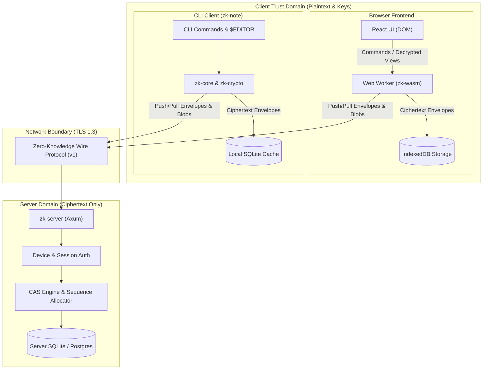

# External Security Review Package (ZK-098)

## 1. Overview & Purpose

This package provides external security researchers, cryptographers, and auditors with the architecture documentation, cryptographic specifications, threat models, verified security claims, and reproducible test suites necessary to conduct an independent security audit of the **Zero-Knowledge Note-Taking System**.

---

## 2. System Architecture & Trust Boundaries

The system is architected around strict cryptographic separation between client-side business logic/decryption and server-side encrypted persistence.



### Core Architecture Principles
1. **Plaintext Isolation**: Decrypted note bodies, titles, tags, and attachment files exist ONLY in volatile client memory while unlocked.
2. **Server Obliviousness**: The server depends exclusively on `crates/zk-protocol` and has NO dependency on `crates/zk-crypto` or `crates/zk-core`. The server is structurally incapable of decrypting notes (SEC-002).
3. **Strict Crate Hierarchy**:
   ```text
   zk-protocol (wire models, error constants, envelope structures)
      ↑
   zk-crypto (XChaCha20-Poly1305, Argon2id, BLAKE2, zeroize)
      ↑
   zk-core (note serialization, domain models, local search)
      ↑
   zk-storage (SQLite & IndexedDB persistence traits)
      ↑
   zk-sync (sync state machine, diff3 three-way merge, CAS)
      ↑
   apps/cli | apps/web | apps/server
   ```

---

## 3. Cryptographic Specifications & ADRs

- **Cryptographic Architecture ADR**: [`docs/adr/0003-cryptographic-architecture.md`](./adr/0003-cryptographic-architecture.md)
  - **Payload & Manifest Cipher Suite**: `xchacha20poly1305` (IETF draft, 256-bit key, 192-bit / 24-byte random nonce).
  - **Key Derivation Function**: `Argon2id v13` (64 MiB RAM, 3 iterations, 1 parallelism, 16-byte random salt).
  - **Subkey & PRF Derivation**: `BLAKE2b` / `BLAKE2s`.
  - **Memory Scrubbing**: `zeroize::Zeroize` on drop for all key buffers.
  - **Constant-Time Verification**: `subtle::ConstantTimeEq` for MAC and credential comparisons.
- **Wire Protocol Specification**: [`docs/protocol/v1.md`](./protocol/v1.md)
- **Web Worker RPC Protocol**: [`docs/protocol/worker-api.md`](./protocol/worker-api.md)

---

## 4. Verified Security Claims

| Claim ID | Formal Security Claim | Verified Under |
| :--- | :--- | :--- |
| **CLAIM-01** | **Confidentiality against Server**: An attacker with full read access to the server database, backups, filesystem, and logs cannot read note titles, bodies, tags, attachment contents, or filenames. | SEC-001, SEC-002, `apps/server/tests/plaintext_leakage_tests.rs`, `apps/server/tests/backup_restore_tests.rs` |
| **CLAIM-02** | **Integrity & Authenticity**: Any unauthorized modification, bit-flip, truncation, or substitution of ciphertext envelopes or chunk payloads is detected and rejected without processing (fail closed). | SEC-004, SEC-010, `tests/wasm_crypto_compat.test.mjs`, `crates/zk-crypto/src/` unit tests |
| **CLAIM-03** | **Anti-Collision & Nonce Safety**: XChaCha20-Poly1305's 192-bit nonce space renders birthday-bound random nonce collisions impossible ($2^{-96}$ probability). | SEC-005, `crates/zk-crypto/src/object.rs` |
| **CLAIM-04** | **Replay & Concurrency Safety**: The server rejects stale writes via atomic Compare-And-Swap (`expected_revision`), guarantees idempotency for retried mutations, and preserves monotonic sequence ordering. | SEC-006, SEC-007, `apps/server/tests/concurrency_stress_tests.rs`, `apps/server/tests/protocol_property_tests.rs` |
| **CLAIM-05** | **Multi-Tenant Isolation**: Account A cannot access, query, overwrite, or confirm the existence of Account B's objects, revision history, or attachments (anti-oracle). | SEC-006, `apps/server/tests/authorization_penetration_tests.rs` |
| **CLAIM-06** | **Encrypted Local Persistence**: Persistent client storage (native SQLite `.sqlite` and browser IndexedDB) stores ciphertext only. | SEC-009, `apps/server/tests/plaintext_leakage_tests.rs`, `apps/web/test/plaintext-leakage.test.ts` |
| **CLAIM-07** | **Zero Secrets in Logs**: Passphrases, keys, authorization tokens, and notes are never emitted in structured logs. | SEC-003, `apps/server/tests/server_skeleton_tests.rs`, `apps/server/tests/plaintext_leakage_tests.rs` |

---

## 5. Auditor Verification Commands & Test Suites

The entire codebase is equipped with automated test suites runnable with standard tools:

### 5.1 Full Repository Quality Gate
```bash
./scripts/ci.sh
```
Executes all 9 gates:
1. `cargo fmt --check`
2. `cargo clippy --workspace --all-targets --all-features -- -D warnings`
3. `cargo check --workspace --locked`
4. `cargo test --workspace --all-targets --all-features` (all Rust unit/integration suites)
5. `cargo check --target wasm32-unknown-unknown`
6. `wasm-pack test --node crates/zk-wasm`
7. Native / WASM cross-runtime crypto compatibility suite (`tests/wasm_crypto_compat.test.mjs`)
8. Web application tests (`npm run typecheck && npm test` in `apps/web`)
9. Supply-chain and dependency audit (`./scripts/audit.sh`)

### 5.2 Specific Security Audit Test Suites

```bash
# 1. Plaintext Leakage Audit (Scans Server DB, logs, network captures, client storage)
cargo test --test plaintext_leakage_tests -p zk-server

# 2. Concurrency & CAS Stress Suite (50-client races, crash restart recovery)
cargo test --test concurrency_stress_tests -p zk-server

# 3. Protocol Property & Fuzzing Suite (500-step state machine model test)
cargo test --test protocol_property_tests -p zk-server

# 4. Authorization Penetration & IDOR Suite (Cross-account isolation, revoked tokens)
cargo test --test authorization_penetration_tests -p zk-server

# 5. Backup & Restore Decryption Lifecycle Suite (Snapshot audit & client restore)
cargo test --test backup_restore_tests -p zk-server

# 6. Browser XSS & CSP Penetration Suite
npm test --prefix apps/web -- test/xss-csp-review.test.ts

# 7. IndexedDB Zero-Knowledge Storage Audit
npm test --prefix apps/web -- test/plaintext-leakage.test.ts
```

---

## 6. Reproducible Demo Accounts & Vectors

### Test Vault Credentials
- **Test Passphrase**: `correct-battery-horse-staple-vault-2026!`
- **Argon2id Salt**: `0x42` repeated 16 times (`QkJCQkJCQkJCQkJCQkJCQg==`)
- **KDF Parameters**: memory = 64 MiB, iterations = 3, parallelism = 1.
- **Recovery Key Format**: 24-word or hex-encoded 256-bit entropy token.

### Deterministic Test Vectors
Auditors can inspect [`crates/zk-crypto/tests/test_vectors.rs`](../crates/zk-crypto/tests/test_vectors.rs) and [`tests/wasm_crypto_compat.test.mjs`](../tests/wasm_crypto_compat.test.mjs) for hardcoded cross-runtime test vectors verifying identical cryptographic behavior across native Linux x86_64, macOS ARM64, and WebAssembly in Node/Browser runtimes.
